<!--
  Every image below is a hand-built, animated SVG generated by scripts/profile/build.py
  (fonts embedded, CSS-only motion, light + dark variants). Activity refreshes daily via
  .github/workflows/profile-assets.yml. Edit the copy in build.py, not the SVGs.
-->

<a href="https://cemkoyluoglu.codes">
  <picture>
    <source media="(prefers-color-scheme: dark)" srcset="assets/hero-dark.svg">
    
  </picture>
</a>

<p align="center">
  <a href="https://cemkoyluoglu.codes"><picture><source media="(prefers-color-scheme: dark)" srcset="assets/pill-site-dark.svg"></picture></a>
  <a href="https://www.linkedin.com/in/cem-koyluoglu/"><picture><source media="(prefers-color-scheme: dark)" srcset="assets/pill-linkedin-dark.svg"></picture></a>
  <a href="https://x.com/Cockroachs_"><picture><source media="(prefers-color-scheme: dark)" srcset="assets/pill-x-dark.svg"></picture></a>
  <a href="https://huggingface.co/CemRoot"><picture><source media="(prefers-color-scheme: dark)" srcset="assets/pill-hf-dark.svg"></picture></a>
  <a href="https://orcid.org/0009-0002-1117-0876"><picture><source media="(prefers-color-scheme: dark)" srcset="assets/pill-orcid-dark.svg"></picture></a>
</p>

<picture>
  <source media="(prefers-color-scheme: dark)" srcset="assets/marquee-dark.svg">
  
</picture>

<picture>
  <source media="(prefers-color-scheme: dark)" srcset="assets/h-whoami-dark.svg">
  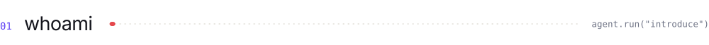
</picture>

<picture>
  <source media="(prefers-color-scheme: dark)" srcset="assets/about-dark.svg">
  
</picture>

I'm Cem, a GenAI engineer based in Dublin. I build LLM agents, retrieval pipelines and the evals that keep them honest, and I care most about the unglamorous part: getting them into production and keeping them useful there. My MSc research on deepfake detection was peer-reviewed and published by Springer.

<br>

<picture>
  <source media="(prefers-color-scheme: dark)" srcset="assets/h-selected-work-dark.svg">
  
</picture>

<p align="center">
  <a href="https://github.com/CemRoot/yt-ai-summarizer"><picture><source media="(prefers-color-scheme: dark)" srcset="assets/card-gleano-dark.svg">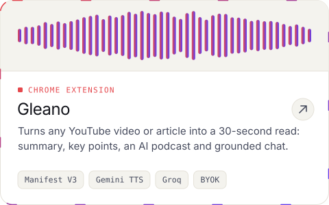</picture></a>
  <a href="https://github.com/CemRoot/deepfake-detection-streamlit"><picture><source media="(prefers-color-scheme: dark)" srcset="assets/card-deepfake-dark.svg"></picture></a>
</p>
<p align="center">
  <a href="https://github.com/CemRoot/ai-broker"><picture><source media="(prefers-color-scheme: dark)" srcset="assets/card-aibroker-dark.svg"></picture></a>
  <a href="https://cemkoyluoglu.codes"><picture><source media="(prefers-color-scheme: dark)" srcset="assets/card-site-dark.svg"></picture></a>
</p>
<p align="center">
  <a href="https://github.com/CemRoot/Ireland-Rag_model"><picture><source media="(prefers-color-scheme: dark)" srcset="assets/card-irelandrag-dark.svg"></picture></a>
  <a href="https://github.com/CemRoot/Daft.ie-Dublin-Monitor"><picture><source media="(prefers-color-scheme: dark)" srcset="assets/card-daft-dark.svg"></picture></a>
</p>

<br>

<picture>
  <source media="(prefers-color-scheme: dark)" srcset="assets/h-research-dark.svg">
  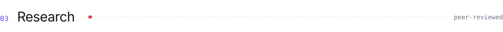
</picture>

<a href="https://link.springer.com/chapter/10.1007/978-3-032-25809-0_32">
  <picture>
    <source media="(prefers-color-scheme: dark)" srcset="assets/research-dark.svg">
    
  </picture>
</a>

<p align="center">
  <a href="https://link.springer.com/chapter/10.1007/978-3-032-25809-0_32"><b>Paper</b></a> ·
  <a href="https://huggingface.co/spaces/CemRoot/deepfake-detection-aics2025"><b>Live demo</b></a> ·
  <a href="https://huggingface.co/CemRoot/deepfake-detection-model"><b>Model weights</b></a> ·
  <a href="https://github.com/CemRoot/Master-Uni-Project"><b>Thesis code</b></a>
</p>

<details>
<summary><b>Cite this paper</b></summary>

```bibtex
@inproceedings{koyluoglu2026deepfake,
  title     = {A Novel Deep Learning Framework for DeepFake Detection Using Attention-Enhanced EfficientNet-B7},
  author    = {Koyluoglu, E. C. and Staikopoulos, A. and Raj, K.},
  booktitle = {Artificial Intelligence and Cognitive Science (AICS 2025)},
  series    = {Communications in Computer and Information Science},
  volume    = {2950},
  pages     = {401--413},
  publisher = {Springer, Cham},
  year      = {2026},
  doi       = {10.1007/978-3-032-25809-0_32}
}
```

</details>

<br>

<picture>
  <source media="(prefers-color-scheme: dark)" srcset="assets/h-toolbox-dark.svg">
  
</picture>

<picture>
  <source media="(prefers-color-scheme: dark)" srcset="assets/toolbox-dark.svg">
  
</picture>

<br>

<picture>
  <source media="(prefers-color-scheme: dark)" srcset="assets/h-activity-dark.svg">
  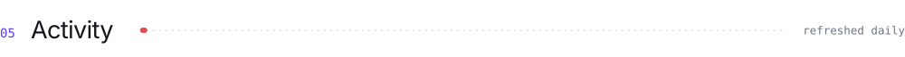
</picture>

<picture>
  <source media="(prefers-color-scheme: dark)" srcset="assets/activity-dark.svg">
  
</picture>

<br>

<picture>
  <source media="(prefers-color-scheme: dark)" srcset="assets/footer-dark.svg">
  
</picture>

<p align="center">
  <a href="https://hits.sh/github.com/CemRoot/"></a>
  &nbsp;
  <a href="https://app.daily.dev/samroot"></a>
</p>
